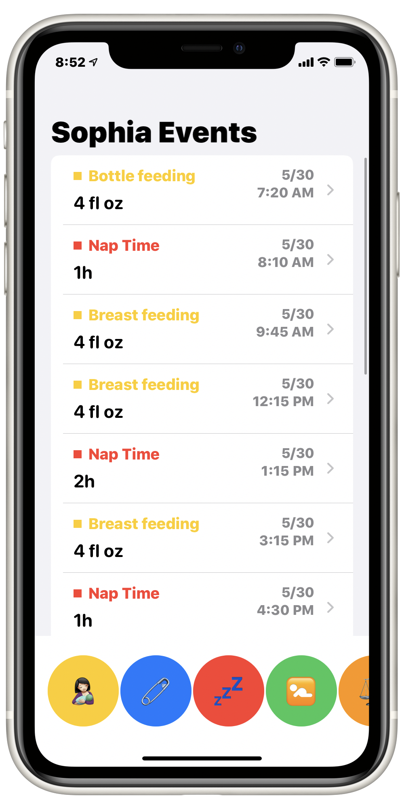
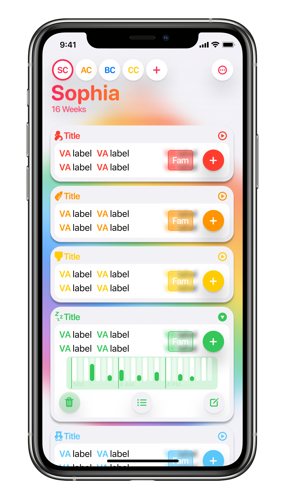

# PoopDeck { Working Title }

Baby activity data tracking and visualization. HealthKit for Babies. Timeline of baby events and milestones, visualize averages, predict nap times + feedings

`main`

Figma Design Goal

### Design System

The design system I built out for this app is summarized here in a [Figma Document](https://www.figma.com/file/DFehJGP23akjAsEZMBZwxB/PoopDeck-Design-System?node-id=0%3A1)

This was built after WWDC with the intention of rebuilding the UI for an iOS 14 minimum. Most of the current code was written before WWDC for iOS 13.

## Build

### Installing

No dependencies other than [Xcode](https://apps.apple.com/us/app/xcode/id497799835?mt=12)

Open in Xcode

If not a registered iOS developer, make sure to select a simulator in the Target List. Running on device may be possible with correct iCloud account.

## UIDocument

PoopDeck reads and writes BabyLogs, custom files that use the `.bblg` extension. As such, PoopDeck requires no accounts, but with iCloud Drive supports document collaboration, mostly offsetting syncing needs other than conflict resolution, which [to be fair](https://www.youtube.com/watch?v=G19B7lTgwCE) is rather large.

Bugs

- In early implementations conflict resolution resulted in lost data when a `BBLG` was open on two devices at the same time. Conflict resolution and file update receiver have both been refactored since then, but this bug hasn't been tested since then in favor of focusing on a 'single user' experience at a time. For now avoid opening 'prime' data on multiple devices.

## Intents

`branch: intents`

PoopDeck will expose read and write events for all events through Intents. This will allow read intents to be displayed in Widgets, allow Siri and Shortcuts to read and write events, and would generally make the app fully useful and accessible without ever opening it on any device.

Example phrases/implementations:

- "Hey Siri, when was Sophia's last nap?"
- "Hey Siri, log three minutes of Tummy Time?"
- "Hey Siri, when was her last nap longer then an hour?"

<sumary>Current State

Have an Intent Extension and an initial `Get Last Diaper Change` intent. Accepted inputs are the Date to filter by (defaults to now), and the `state` of the Diaper (wet, poopy, etc). It shows up correctly in Shortcuts and works with Siri, and my Intent is triggered. I expose the available baby log documents to the user. It works fine with Siri and Shortcuts, hopefully it translates to Widgets easily. The bigger task will just be managing all those intent definitions...

I also need to design a general 'baby summary' payload and have that as a distinct intent

## Current State

##### Working

- Mult-Baby support
- Syncing + Conflict Resolution
- State restoration
- Basic Multi-window support
- View all events in summary

### TODO

##### MVP

- Build Design Components into SwiftUI components
- Rebuild UI with new components
- Menu

##### Known Bugs

- Creating new document creates `MyBabyLog.bblg`, and after setting baby info it saves with the new baby name as the filename. But `MyBabyLog.bblg` remains. Delete the old file, or move rather than create
- Saving document should update the name as well

##### Follow on

- Finish building read intents
- iPad Sidebar
- Start building write intents
- Build summary intent
- Better Multi-window support
